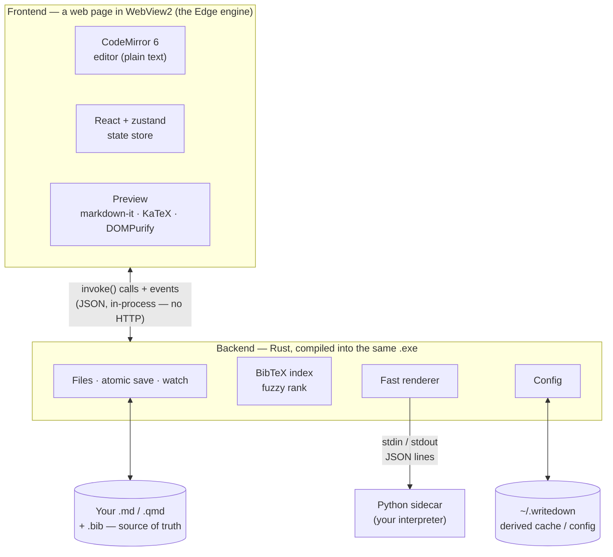

# Writedown

<table>
  <tr valign='top'>
    <td width="70%">
        Writedown delivers a natural file-text-preview flow.  
        <p>
        It is a fast, local, predictable <strong>Markdown and Quarto editor for Windows</strong> providing Joplin-style
        file navigation, Sublime-style editing, live Markdown/Quarto preview with an on-demand Rendered
        view that executes <code>{python}</code> code cells, an automatic document outline, and first-class
        BibTeX citation autocomplete — plus extraction of just the entries you cite — over your own library.
    </td>
    <td>
      
    </td>
  </tr>
</table>


Writedown edits **ordinary files on disk**. There is no vault, no hidden database[^auto], and
no proprietary format. It never renames, moves, or reformats your files unless you ask.
It makes no network requests[^net], keeps no telemetry, needs no account, and works offline.

[^auto]: One nuance: the optional word-completion dictionary counts frequent long words from documents you open, in a small JSON file under `~/.writedown`. It never leaves your machine; switch it off in config or delete the file.

[^net]: With one exception: the preview fetches a remote image if your document links one. Writedown itself never calls out — no updater, no analytics.

> Status: **actively developed** — the core editor, live preview, outline, BibTeX
> citations, projects, and a Python-executing Rendered view are all in place. The
> current version is shown in the app footer.

## What it gives you

- **Ordinary files as truth** — `.md` / `.qmd` stay plain UTF-8 text, editable by
  Sublime, Git, Python, etc., at any time; Writedown reloads external edits safely
  and never rewrites your YAML front matter.
- **Sublime-style editing** — CodeMirror 6 with multiple cursors, column selection,
  find/replace, quick-open, a command palette, and an imported Sublime color scheme;
  plus live spellcheck and highlighting for Python, JSON, YAML, TOML, and TeX.
- **Live Markdown & Quarto preview** — a fast internal renderer with KaTeX math,
  cross-references, an auto-generated References list, and scroll synced to the editor.
- **A Rendered view that runs your code** — an explicit, quick Build executes `{python}` cells
  through a persistent Python interpreter and splices text, tables, and matplotlib
  figures inline; a pure-Rust pipeline, no shell-out to Quarto, your file left untouched.
- **Automatic outline** — heading tree, click to jump, tracks the cursor.
- **First-class BibTeX citations** — type `@` for fzf-style fuzzy autocomplete against
  your config-specified bibtex file library, with matched-letter highlighting; the `.bib` stays read-only.
- **Live checks** — spelling, `{python}` syntax errors and duplicate Quarto labels flagged inline
  as you type, with no external tools.
- **CSV files**  — opened with colored columns and CSV-grid sort, search, filter enabled preview.
- **Projects & sessions** — Sublime-style `.wdproj` projects with multi-root trees, MRU
  quick-switch, and per-workspace session restore.
- **Autosave** — atomic writes; trailing-whitespace trim on save, Sublime-style (all
  line ends, on by default; `"keep-hard-breaks"` spares Markdown two-space breaks,
  `false` disables, CSV data is never trimmed); YAML and everything else preserved
  exactly; clear conflict handling.
- **Extension aware** — opens most text files with theme-matched colorization: python,
  json, yaml, toml, tex, and csv first-class, with c/cpp, css, html, js/ts, R, rst, and
  dozens more loading lazily; outlines for markdown, python, yaml, and toml.
- **Quick peek** — single-click opens a file in a reusable preview tab (Sublime-style);
  it becomes a real tab only when you edit it or double-click.

### How it compares

Writedown is distinguished by two operating principles inspired by the Zen of Python:

* "Now is better than never." It is fast and prioritizes speed over exact rendering fidelity. A good-enough, covers-the-basics Quarto preview **now** is a core design objective.
* "Explicit is better than implicit." It never touches your files, only does what it is told, and creates no artifacts on your disk outside its `~/.writedown` directory.

It overlaps with several tools but these principles distinguish it.

| vs | Writedown's edge |
|---|---|
| **Jupyter Lab / Jupytext** | Jupytext round-trips your document through `.ipynb` and rewrites it — normalizing and reordering YAML, injecting metadata. Writedown edits the file in place and never rewrites your front matter. |
| **`quarto render`** | The real thing is authoritative but slow. Writedown's Rendered view is a fast, ~90%-correct pre-flight — catch citation, cross-reference, and `{python}` errors in a second, *then* run `quarto render` for the publication-exact artifact. |
| **Sublime Text** | A superb editor (Writedown borrows its keymap and theme) but no real Markdown preview and only basic BibTeX. Writedown adds live preview, KaTeX math, and fuzzy citations over your whole library. |
| **Obsidian** | Owns a *vault* — a `.obsidian/` folder, its own link conventions, background rewrites. Writedown adds no directories beside your files and rewrites nothing. |
| **Typora** | Beautiful, but you edit *through* the rendered WYSIWYG view rather than seeing the raw text, it's closed-source commercial, and there's no Quarto cell execution, cross-reference, or BibTeX citation machinery. Writedown keeps the raw text in a real editor, rendering in a separate pane, and is free and open source (MIT). |

Writedown is a generalist: all of these tools beat it in their domains but none offers the same package of capabilities.

## Stack

Tauri 2 · Rust backend (filesystem, atomic saves, watching, config) · TypeScript + React
frontend · CodeMirror 6 · markdown-it preview.

## Install

Windows binaries provided[^build]. Download the installer from the GitHub **Releases** page and run it.
The exe is unsigned, so SmartScreen will warn on first run ("More info" → "Run
anyway") — the warning reflects the missing code-signing certificate, nothing else;
Writedown makes no network requests and never phones home. Or build from source
(needs [Rust](https://rustup.rs) and [Node](https://nodejs.org)):

[^build]: Windows is the only tested and supported platform. The source is Tauri-based
and should build elsewhere, but nobody has tried — expect rough edges, not a guarantee.

```
npm install
npm run tauri build     # → release writedown.exe + NSIS installer
```

## Technical Details

Written for a reader who knows C/C++, Python, SQL, and basic web (HTML/CSS/Flask) but
not Rust or JavaScript. My design; here's what Claude does under the hood.

**TL;DR.** Writedown is built the "web way" but runs entirely on your machine as one
native program. It has two halves fused into a single `.exe`: a **frontend** — a web page
(HTML/CSS plus compiled JavaScript) drawn in an ordinary Windows window by the Edge
rendering engine that already ships with Windows — and a **backend** written in **Rust**
that does everything the page can't safely do itself: read and write your files, watch
folders, parse your 7,000-entry `.bib`, run Python. The two halves call each other's
functions directly, not over HTTP. The closest thing you already know is a Flask app —
except the browser and the server are welded into one program, the "server" is Rust
instead of Python, and the page calls server functions directly instead of fetching
URLs. No server process, no port, no network, no browser permission prompts.



**The framework (Tauri).** The app is a **Tauri** program. If you've heard of Electron
(how VS Code and Slack are built), Tauri is the leaner cousin: Electron ships an entire
copy of Chrome inside every app, whereas Tauri uses the web engine **already built into
Windows** (WebView2, the Edge engine) for the window and pairs it with a Rust backend
compiled into the same executable. So the window you see is literally a web page rendered
by Windows' own browser engine, and "the backend" isn't a separate server — it's Rust
code in the same process, a function call away.

**The bridge (how the page calls Rust).** This is the biggest shift from Flask. There are
no URLs and no request/response cycle. Instead, chosen Rust functions are tagged
`#[tauri::command]` (the rough equivalent of Flask's `@app.route`, but the "route" is
just a function name). From the JavaScript side you write `invoke("read_file", { path })`,
which returns a Promise — an async result — that resolves with whatever the Rust function
returned. Tauri serializes the arguments and the return value as JSON and ferries them
across an in-process channel. So calling the backend feels like `await`-ing a local
function that happens to be written in another language.

**The frontend (TypeScript, React, a state store).** **TypeScript** is JavaScript with
Python-style type hints that are actually checked at compile time (`tsc`), then stripped
to plain JavaScript the webview runs. **React** is the opposite of Jinja: instead of
rendering HTML on the server and reloading the page, React keeps a live model of the page
in the browser and, when your data changes, recomputes only the parts that differ and
patches the real DOM. The app's data lives in one small in-memory **store** (a library
called zustand) — think a single global dictionary of app state (open tabs, current file,
cursor position). UI components subscribe to slices of it; change a slice and exactly the
subscribed bits re-render.

**The editor (CodeMirror 6).** The editing area is not a plain `<textarea>` — it's
CodeMirror 6, a programmable editor engine (the kind that powers in-browser IDEs). It
provides the syntax highlighting, multiple cursors and column selection, the Sublime
keybindings, the `@`-citation autocomplete popup, and the red squiggles for problems, all
assembled from composable "extensions." It only ever holds **plain text**; rendering is a
separate concern entirely.

**The preview (markdown-it, KaTeX, DOMPurify).** The live preview is produced inside the
webview by **markdown-it**, a Markdown→HTML library (the JS cousin of Python's `markdown`
package). Math between `$…$` is typeset by **KaTeX**, and before any of that HTML reaches
the screen, **DOMPurify** scrubs it — removing scripts and anything unsafe — because
Markdown is allowed to contain raw HTML. This all runs client-side; the Rust backend is
not involved in the live preview at all.

**The backend (Rust: files, saves, watching).** Everything that touches the operating
system or must be fast lives in Rust — a compiled, memory-safe systems language (roughly
C++'s speed with guardrails). Saves are **atomic**: it writes to a temporary file and
renames it over the original, so a crash mid-save can never leave a half-written document
(the same trick databases use). It **watches** your folders, so edits made by Git,
Sublime, or Explorer show up and open files reload safely. Your `.md`/`.qmd` files on disk
are the only source of truth; everything under `~/.writedown/` is derived cache and config
it can rebuild (see Configuration).

**Citations (parsed and ranked in Rust).** Your `.bib` (~7,000 entries) is parsed once by
Rust into an in-memory index. When you type `@` and a few letters, the frontend hands that
fragment to Rust, which fuzzy-ranks all 7,000 entries with an fzf-style matcher (the
`skim` algorithm) and returns the best handful, with the matched letters marked for
highlighting. It feels instant because the ranking is native Rust over an in-memory index,
not JavaScript looping over strings. The `.bib` is opened read-only and never rewritten.

**The fast renderer and Python sidecar.** The **Rendered** tab is a small rendering
pipeline written in Rust (not a shell-out to Quarto). It splits your document into prose
and code, resolves `@citations` and `@fig-`/`@sec-` cross-references against the
bibliography and the document's own labels, and for each `{python}` cell it pipes the code
to a **persistent Python process** it launched in the background — a tiny homemade
protocol over stdin/stdout (JSON, one message per line), essentially a minimal Jupyter
kernel. It splices the results — printed text, the last expression's value, pandas tables,
matplotlib figures (returned as base64-encoded PNGs) — back into the document, then hands
the expanded Markdown to the same markdown-it preview. It never writes a temporary copy of
your file. (Image links like `` or `` are rewritten to a
special local-file URL that the webview is permitted to load off disk.)

**From source to running app.** Two toolchains turn the source into the program you run.
The frontend (TypeScript/React) is bundled by **Vite** into a small set of `.js`/`.css`
files; the Rust is compiled by **cargo** into native code. In development (`tauri dev`),
Vite hot-swaps frontend edits into the live window in milliseconds, and Rust is recompiled
and the window relaunched when backend code changes. A release build (`tauri build`)
compiles everything optimized and packages it into a single `writedown.exe` plus an
installer — the web engine is already present on every Windows machine, so nothing like
Chromium is bundled.

## Limitations

The internal preview is a deliberately **fast 80–90% approximation** — a good-enough live
look while you draft, not a Quarto/Pandoc replacement. That trade is the whole point: it
renders instantly on every keystroke because it does the common things and skips the long
tail. For publication-exact output, run `quarto render` yourself; Writedown never pretends
to be that last mile.

**What the preview does:** CommonMark + tables, footnotes, task lists, strikethrough;
LaTeX math via KaTeX; BibTeX citations and an auto-generated References list;
cross-references (`@fig-`, `@tbl-`, `@sec-`, `@eq-`) with numbering; `{python}` cell
execution with text, tables, and matplotlib figures spliced in; local images (relative and
absolute); basic image attributes `{width=… #id .class}`; and Mermaid diagrams
(` ```mermaid ` / ` ```{mermaid} `, rendered to static SVG, light/dark aware).

**What it does not** (by design — reach for `quarto render` if you need these):

- **Interactive / runtime-JS output.** Plotly, Bokeh, ipywidgets, or any embedded HTML that
  needs its own JavaScript running to work. The preview is static and sanitized (scripts
  are stripped), so an interactive plot won't render — a hard boundary, not a bug.
  (Mermaid is supported because it renders *to* static SVG once, rather than needing a live
  runtime.)
- **Full Quarto/Pandoc semantics.** `fig-align`, column/margin layouts, panels/tabsets,
  callouts, fenced-div and span attributes, includes/shortcodes, and YAML-driven formatting
  are ignored rather than honored. The References list is an APA-ish approximation, not a
  CSL/citeproc rendering.
- **Non-Python engines.** `{r}`, `{julia}`, etc. cells are shown as source, never executed.

The honest line: if your document leans on heavy Quarto features, lots of Plotly or custom
JavaScript, or needs publication-exact typesetting, Writedown's preview is not the right
tool for that — use the real Quarto toolchain. Writedown is for fast, predictable writing
with a faithful-enough live view of the everyday 90%.

## Configuration

Created on first launch under `~/.writedown/` (`C:\Users\<you>\.writedown\`):
`config.toml`, `session.json`, and disposable `cache/` · `index/` · `logs/` · `themes/`.
See `writedown-spec.md` §5 for the full config schema. Nothing here is a source of truth
for your documents — it is all derived and reconstructible.

**Multiple instances.** There is no single-instance guard: two copies of the exe (or the
installed exe alongside a dev build) run fine, and document saves stay atomic and safe.
They share `~/.writedown/`, though, so session and recent-project writes are
last-writer-wins — avoid opening the *same workspace* in two instances at once.

## Development

`npm run tauri dev` for the live dev build (Vite HMR), `npm run tauri build` for the
release `.exe` — full command list in `CLAUDE.md`. All build churn (Rust `target/`,
`node_modules/`) lives on the `V:` developer drive, not in this folder — see `CLAUDE.md`.

Hard-won notes:

- **Run cargo with its working directory inside `src-tauri/`** — never
  `cargo --manifest-path` from the repo root. Cargo reads `.cargo/config.toml` from the
  *current directory*, not the manifest's, so a root-run misses the `target-dir = V:`
  override and dumps gigabytes of build output into this synced tree.
- **A new `@tauri-apps/api` window/webview call needs a matching grant** in
  `src-tauri/capabilities/default.json`, added in the same change. ACL denials are
  silent promise rejections — invisible under `.catch(() => {})` — which is how the
  1.66.x unclosable-window bug shipped.
- **Python kernel integration tests** (`cargo test -- --ignored`, from `src-tauri/`)
  need `WRITEDOWN_TEST_PYTHON` pointing at a real interpreter — the `python` on PATH
  is typically the Microsoft Store stub.

## License

[MIT](LICENSE) © 2026 Stephen J. Mildenhall. The open-source components Writedown
builds on — and the bundled data, like the SCOWL-derived spell dictionary — are
listed with their licenses in [THIRD-PARTY-NOTICES.md](THIRD-PARTY-NOTICES.md)[^regen].

[^regen]: Notices can be regenerated after a dependency change with `pwsh scripts/generate-notices.ps1`.
