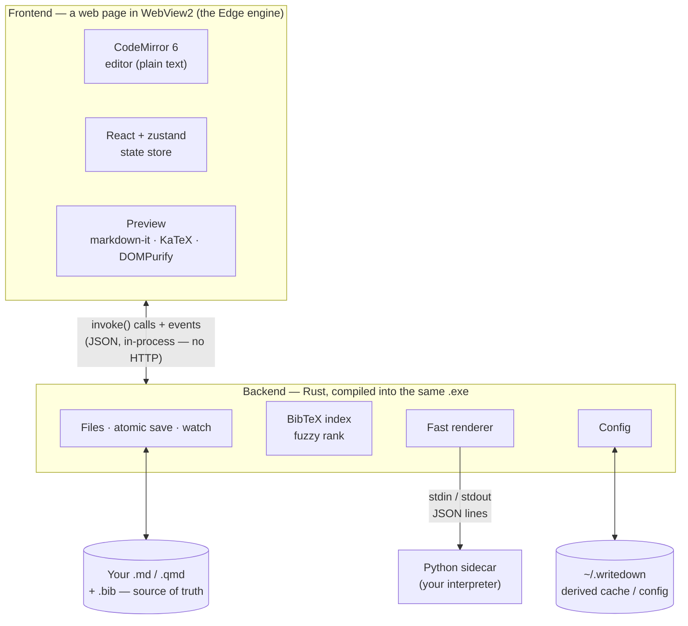

# Writedown

A fast, local, predictable **Markdown and Quarto editor for Windows**. Joplin-style
file navigation, Sublime-style editing, live Markdown/Quarto preview, an automatic
document outline, and first-class BibTeX citation autocomplete over your own
authoritative library.

Writedown edits **ordinary files on disk**. There is no vault, no hidden database, and
no proprietary format. It never renames, moves, or reformats your files unless you ask.
It makes no network requests, keeps no telemetry, needs no account, and works offline.

> Status: **early development.** Building up from `v1.0.0` per the phased plan in
> `writedown-spec.md` §30. The current version is shown in the app footer.

## What it gives you

- **Ordinary files as truth** — `.md` / `.qmd` stay plain UTF-8 text, editable by
  Sublime, Git, Python, or Explorer at any time; Writedown reloads external edits safely.
- **Sublime-style editing** — CodeMirror 6 with multiple cursors, column selection,
  find/replace, quick-open, and a command palette, wired through a real command layer.
- **Markdown & Quarto preview** — fast internal renderer; exact rendering on an explicit
  `quarto render` (never automatic).
- **Automatic outline** — heading tree on the right, click to jump, tracks the cursor.
- **BibTeX citations** — type `@` for fzf-style fuzzy autocomplete against your ~7,000-entry
  library, with matched-letter highlighting; the `.bib` file is read-only and untouched.
- **Autosave** — atomic, conservative trailing-whitespace cleanup, hard-breaks preserved,
  YAML front matter preserved exactly, clear conflict handling.

## Stack

Tauri 2 · Rust backend (filesystem, atomic saves, watching, config) · TypeScript + React
frontend · CodeMirror 6 · markdown-it preview.

## Technical Details

Written for a reader who knows C/C++, Python, SQL, and basic web (HTML/CSS/Flask) but
not Rust or JavaScript. My design; here's what Claude does under the hood.

**TL;DR.** Writedown is built the "web way" but runs entirely on your machine as one
native program. It has two halves fused into a single `.exe`: a **frontend** — a web page
(HTML/CSS plus compiled JavaScript) drawn in an ordinary Windows window by the Edge
rendering engine that already ships with Windows — and a **backend** written in **Rust**
that does everything the page can't safely do itself: read and write your files, watch
folders, parse your 7,000-entry `.bib`, run Python. The two halves call each other's
functions directly, not over HTTP. The closest thing you already know is a Flask app —
except the browser and the server are welded into one program, the "server" is Rust
instead of Python, and the page calls server functions directly instead of fetching
URLs. No server process, no port, no network, no browser permission prompts.



**The framework (Tauri).** The app is a **Tauri** program. If you've heard of Electron
(how VS Code and Slack are built), Tauri is the leaner cousin: Electron ships an entire
copy of Chrome inside every app, whereas Tauri uses the web engine **already built into
Windows** (WebView2, the Edge engine) for the window and pairs it with a Rust backend
compiled into the same executable. So the window you see is literally a web page rendered
by Windows' own browser engine, and "the backend" isn't a separate server — it's Rust
code in the same process, a function call away.

**The bridge (how the page calls Rust).** This is the biggest shift from Flask. There are
no URLs and no request/response cycle. Instead, chosen Rust functions are tagged
`#[tauri::command]` (the rough equivalent of Flask's `@app.route`, but the "route" is
just a function name). From the JavaScript side you write `invoke("read_file", { path })`,
which returns a Promise — an async result — that resolves with whatever the Rust function
returned. Tauri serializes the arguments and the return value as JSON and ferries them
across an in-process channel. So calling the backend feels like `await`-ing a local
function that happens to be written in another language.

**The frontend (TypeScript, React, a state store).** **TypeScript** is JavaScript with
Python-style type hints that are actually checked at compile time (`tsc`), then stripped
to plain JavaScript the webview runs. **React** is the opposite of Jinja: instead of
rendering HTML on the server and reloading the page, React keeps a live model of the page
in the browser and, when your data changes, recomputes only the parts that differ and
patches the real DOM. The app's data lives in one small in-memory **store** (a library
called zustand) — think a single global dictionary of app state (open tabs, current file,
cursor position). UI components subscribe to slices of it; change a slice and exactly the
subscribed bits re-render.

**The editor (CodeMirror 6).** The editing area is not a plain `<textarea>` — it's
CodeMirror 6, a programmable editor engine (the kind that powers in-browser IDEs). It
provides the syntax highlighting, multiple cursors and column selection, the Sublime
keybindings, the `@`-citation autocomplete popup, and the red squiggles for problems, all
assembled from composable "extensions." It only ever holds **plain text**; rendering is a
separate concern entirely.

**The preview (markdown-it, KaTeX, DOMPurify).** The live preview is produced inside the
webview by **markdown-it**, a Markdown→HTML library (the JS cousin of Python's `markdown`
package). Math between `$…$` is typeset by **KaTeX**, and before any of that HTML reaches
the screen, **DOMPurify** scrubs it — removing scripts and anything unsafe — because
Markdown is allowed to contain raw HTML. This all runs client-side; the Rust backend is
not involved in the live preview at all.

**The backend (Rust: files, saves, watching).** Everything that touches the operating
system or must be fast lives in Rust — a compiled, memory-safe systems language (roughly
C++'s speed with guardrails). Saves are **atomic**: it writes to a temporary file and
renames it over the original, so a crash mid-save can never leave a half-written document
(the same trick databases use). It **watches** your folders, so edits made by Git,
Sublime, or Explorer show up and open files reload safely. Your `.md`/`.qmd` files on disk
are the only source of truth; everything under `~/.writedown/` is derived cache and config
it can rebuild (see Configuration).

**Citations (parsed and ranked in Rust).** Your `.bib` (~7,000 entries) is parsed once by
Rust into an in-memory index. When you type `@` and a few letters, the frontend hands that
fragment to Rust, which fuzzy-ranks all 7,000 entries with an fzf-style matcher (the
`skim` algorithm) and returns the best handful, with the matched letters marked for
highlighting. It feels instant because the ranking is native Rust over an in-memory index,
not JavaScript looping over strings. The `.bib` is opened read-only and never rewritten.

**The fast renderer and Python sidecar.** The **Rendered** tab is a small rendering
pipeline written in Rust (not a shell-out to Quarto). It splits your document into prose
and code, resolves `@citations` and `@fig-`/`@sec-` cross-references against the
bibliography and the document's own labels, and for each `{python}` cell it pipes the code
to a **persistent Python process** it launched in the background — a tiny homemade
protocol over stdin/stdout (JSON, one message per line), essentially a minimal Jupyter
kernel. It splices the results — printed text, the last expression's value, pandas tables,
matplotlib figures (returned as base64-encoded PNGs) — back into the document, then hands
the expanded Markdown to the same markdown-it preview. It never writes a temporary copy of
your file. (Image links like `` or `` are rewritten to a
special local-file URL that the webview is permitted to load off disk.)

**From source to running app.** Two toolchains turn the source into the program you run.
The frontend (TypeScript/React) is bundled by **Vite** into a small set of `.js`/`.css`
files; the Rust is compiled by **cargo** into native code. In development (`tauri dev`),
Vite hot-swaps frontend edits into the live window in milliseconds, and Rust is recompiled
and the window relaunched when backend code changes. A release build (`tauri build`)
compiles everything optimized and packages it into a single `writedown.exe` plus an
installer — the web engine is already present on every Windows machine, so nothing like
Chromium is bundled.

## Limitations

The internal preview is a deliberately **fast 80–90% approximation** — a good-enough live
look while you draft, not a Quarto/Pandoc replacement. That trade is the whole point: it
renders instantly on every keystroke because it does the common things and skips the long
tail. For publication-exact output, run `quarto render` yourself; Writedown never pretends
to be that last mile.

**What the preview does:** CommonMark + tables, footnotes, task lists, strikethrough;
LaTeX math via KaTeX; BibTeX citations and an auto-generated References list;
cross-references (`@fig-`, `@tbl-`, `@sec-`, `@eq-`) with numbering; `{python}` cell
execution with text, tables, and matplotlib figures spliced in; local images (relative and
absolute); basic image attributes `{width=… #id .class}`; and Mermaid diagrams
(` ```mermaid ` / ` ```{mermaid} `, rendered to static SVG, light/dark aware).

**What it does not** (by design — reach for `quarto render` if you need these):

- **Interactive / runtime-JS output.** Plotly, Bokeh, ipywidgets, or any embedded HTML that
  needs its own JavaScript running to work. The preview is static and sanitized (scripts
  are stripped), so an interactive plot won't render — a hard boundary, not a bug.
  (Mermaid is supported because it renders *to* static SVG once, rather than needing a live
  runtime.)
- **Full Quarto/Pandoc semantics.** `fig-align`, column/margin layouts, panels/tabsets,
  callouts, fenced-div and span attributes, includes/shortcodes, and YAML-driven formatting
  are ignored rather than honored. The References list is an APA-ish approximation, not a
  CSL/citeproc rendering.
- **Non-Python engines.** `{r}`, `{julia}`, etc. cells are shown as source, never executed.

The honest line: if your document leans on heavy Quarto features, lots of Plotly or custom
JavaScript, or needs publication-exact typesetting, Writedown's preview is not the right
tool for that — use the real Quarto toolchain. Writedown is for fast, predictable writing
with a faithful-enough live view of the everyday 90%.

## Configuration

Created on first launch under `~/.writedown/` (`C:\Users\<you>\.writedown\`):
`config.toml`, `session.json`, and disposable `cache/` · `index/` · `logs/` · `themes/`.
See `writedown-spec.md` §5 for the full config schema. Nothing here is a source of truth
for your documents — it is all derived and reconstructible.

**Multiple instances.** There is no single-instance guard: two copies of the exe (or the
installed exe alongside a dev build) run fine, and document saves stay atomic and safe.
They share `~/.writedown/`, though, so session and recent-project writes are
last-writer-wins — avoid opening the *same workspace* in two instances at once.

## Development

`npm run tauri dev` for the live dev build (Vite HMR), `npm run tauri build` for the
release `.exe` — full command list in `CLAUDE.md`. All build churn (Rust `target/`,
`node_modules/`) lives on the `V:` developer drive, not in this folder — see `CLAUDE.md`.

Hard-won notes:

- **Run cargo with its working directory inside `src-tauri/`** — never
  `cargo --manifest-path` from the repo root. Cargo reads `.cargo/config.toml` from the
  *current directory*, not the manifest's, so a root-run misses the `target-dir = V:`
  override and dumps gigabytes of build output into this synced tree.
- **A new `@tauri-apps/api` window/webview call needs a matching grant** in
  `src-tauri/capabilities/default.json`, added in the same change. ACL denials are
  silent promise rejections — invisible under `.catch(() => {})` — which is how the
  1.66.x unclosable-window bug shipped.
- **Python kernel integration tests** (`cargo test -- --ignored`, from `src-tauri/`)
  need `WRITEDOWN_TEST_PYTHON` pointing at a real interpreter — the `python` on PATH
  is typically the Microsoft Store stub.

## License

TBD.

**Bundled data.** The spellchecker embeds the English (US) Hunspell dictionary derived from
[SCOWL](http://wordlist.sourceforge.net) (Kevin Atkinson) with affix rules by Geoff Kuenning,
via [wooorm/dictionaries](https://github.com/wooorm/dictionaries) (UTF-8 normalized). It is
distributed under the permissive SCOWL and BSD licenses; the full text ships alongside the data
at `src-tauri/assets/dict/LICENSE-en_US.txt`.
